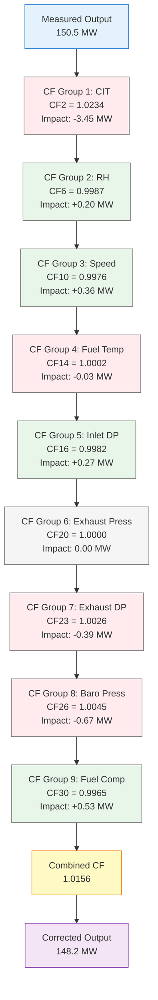

# Gas Turbine Corrected Output Calculation - Process Flow Diagram
## Infographic Design Instructions

---

## Overview

This document provides instructions for creating a continuous process flow diagram that illustrates the methodology for calculating corrected gas turbine output by incorporating all 33 correction factors across 9 functional groups.

---

## Diagram Purpose

Visualize the step-by-step transformation of measured gas turbine output into corrected output at baseline conditions by applying multiplicative correction factors derived from operational parameters.

---

## Diagram Structure

### Layout: Vertical Flow (Top to Bottom)

```
┌─────────────────────────────────────────────────────────────────┐
│                    MEASURED OUTPUT (MW)                         │
│                    GT1X_Gen_MW = 150.5 MW                       │
│                    (Actual operating conditions)                │
└─────────────────────────────────────────────────────────────────┘
                              ↓
┌─────────────────────────────────────────────────────────────────┐
│              CORRECTION FACTOR CALCULATION                      │
│                  (9 Functional Groups)                          │
└─────────────────────────────────────────────────────────────────┘
                              ↓
        ┌─────────────────────────────────────────┐
        │  CF GROUP 1: COMPRESSOR INLET TEMP      │
        │  Input: CIT_degC = 25.3°C               │
        │  Baseline: 15.0°C                       │
        │  → CF2_OutputRatio = 1.0234             │
        │  Impact: -3.45 MW                       │
        └─────────────────────────────────────────┘
                              ↓
        ┌─────────────────────────────────────────┐
        │  CF GROUP 2: RELATIVE HUMIDITY          │
        │  Input: RH_at_CIT = 65.2%               │
        │  Baseline: 48.5%                        │
        │  → CF6_OutputRatio = 0.9987             │
        │  Impact: +0.20 MW                       │
        └─────────────────────────────────────────┘
                              ↓
        ┌─────────────────────────────────────────┐
        │  CF GROUP 3: SHAFT SPEED                │
        │  Input: SpeedRatio = 0.998              │
        │  Baseline: 1.000                        │
        │  → CF10_OutputRatio = 0.9976            │
        │  Impact: +0.36 MW                       │
        └─────────────────────────────────────────┘
                              ↓
        ┌─────────────────────────────────────────┐
        │  CF GROUP 4: FUEL TEMPERATURE           │
        │  Input: FuelTemp_degC = 22.5°C          │
        │  Baseline: 26.7°C                       │
        │  → CF14_OutputRatio = 1.0002            │
        │  Impact: -0.03 MW                       │
        └─────────────────────────────────────────┘
                              ↓
        ┌─────────────────────────────────────────┐
        │  CF GROUP 5: INLET PRESSURE LOSS        │
        │  Input: InletDP_mmH2O = 140.5           │
        │  Baseline: 127.0 mm H₂O                 │
        │  → CF16_OutputRatio = 0.9982            │
        │  Impact: +0.27 MW                       │
        └─────────────────────────────────────────┘
                              ↓
        ┌─────────────────────────────────────────┐
        │  CF GROUP 6: EXHAUST BACK-PRESSURE      │
        │  Input: DeltaExhDP_mmH2O = 0.0          │
        │  Baseline: 0.0 mm H₂O                   │
        │  → CF20_OutputRatio = 1.0000            │
        │  Impact: 0.00 MW                        │
        └─────────────────────────────────────────┘
                              ↓
        ┌─────────────────────────────────────────┐
        │  CF GROUP 7: HRSG DUCT PRESSURE         │
        │  Input: ExhaustDP_mmH2O = 266.7         │
        │  Baseline: 337.82 mm H₂O                │
        │  → CF23_OutputRatio = 1.0026            │
        │  Impact: -0.39 MW                       │
        └─────────────────────────────────────────┘
                              ↓
        ┌─────────────────────────────────────────┐
        │  CF GROUP 8: BAROMETRIC PRESSURE        │
        │  Input: BaroPressure_mbara = 1012.5     │
        │  Baseline: 1005.91 mbar                 │
        │  → CF26_OutputRatio = 1.0045            │
        │  Impact: -0.67 MW                       │
        └─────────────────────────────────────────┘
                              ↓
        ┌─────────────────────────────────────────┐
        │  CF GROUP 9: FUEL COMPOSITION           │
        │  Input: FuelLHV_kJkg = 12,450           │
        │         HC_ratio = 3.92                 │
        │  Baseline: 12,552 kJ/kg, H/C = 3.86     │
        │  → CF30_OutputRatio = 0.9965            │
        │  Impact: +0.53 MW                       │
        └─────────────────────────────────────────┘
                              ↓
┌─────────────────────────────────────────────────────────────────┐
│           COMBINED CORRECTION FACTOR CALCULATION                │
│                                                                 │
│  Combined_OutputCF = CF2 × CF6 × CF10 × CF14 × CF16 ×         │
│                      CF20 × CF23 × CF26 × CF30                 │
│                                                                 │
│  Combined_OutputCF = 1.0234 × 0.9987 × 0.9976 × 1.0002 ×      │
│                      0.9982 × 1.0000 × 1.0026 × 1.0045 ×      │
│                      0.9965                                     │
│                                                                 │
│  Combined_OutputCF = 1.0156                                    │
│                                                                 │
│  Total Impact = -3.45 + 0.20 + 0.36 - 0.03 + 0.27 +           │
│                 0.00 - 0.39 - 0.67 + 0.53 = -3.18 MW          │
└─────────────────────────────────────────────────────────────────┘
                              ↓
┌─────────────────────────────────────────────────────────────────┐
│              CORRECTED OUTPUT CALCULATION                       │
│                                                                 │
│  CorrectedOutput_MW = MeasuredOutput_MW / Combined_OutputCF    │
│                                                                 │
│  CorrectedOutput_MW = 150.5 MW / 1.0156                        │
│                                                                 │
│  CorrectedOutput_MW = 148.2 MW                                 │
│                                                                 │
│  (Output normalized to baseline conditions)                    │
└─────────────────────────────────────────────────────────────────┘
```

---

## Design Specifications

### Color Scheme

1. **Measured Output Box** (Top)
   - Background: Light Blue (#E3F2FD)
   - Border: Dark Blue (#1976D2)
   - Text: Dark Blue (#0D47A1)

2. **CF Group Boxes** (Middle Section)
   - Background: Light Green (#E8F5E9) for CF < 1.0 (positive impact)
   - Background: Light Red (#FFEBEE) for CF > 1.0 (negative impact)
   - Background: Light Gray (#F5F5F5) for CF = 1.0 (no impact)
   - Border: Medium Gray (#757575)
   - Text: Black (#000000)

3. **Combined CF Box**
   - Background: Light Yellow (#FFF9C4)
   - Border: Orange (#F57C00)
   - Text: Dark Orange (#E65100)

4. **Corrected Output Box** (Bottom)
   - Background: Light Purple (#F3E5F5)
   - Border: Dark Purple (#7B1FA2)
   - Text: Dark Purple (#4A148C)

5. **Arrows**
   - Color: Dark Gray (#424242)
   - Width: 3px
   - Style: Solid with arrowhead

### Typography

- **Headers**: Bold, 14pt, Sans-serif (e.g., Arial, Helvetica)
- **Parameter Names**: Regular, 11pt, Sans-serif
- **Values**: Bold, 11pt, Monospace (e.g., Courier New)
- **Impact Values**: Bold Italic, 10pt, Sans-serif
- **Formulas**: Regular, 10pt, Monospace

### Box Dimensions

- **Width**: 600px (consistent across all boxes)
- **Height**: 
  - Measured Output: 80px
  - CF Group boxes: 100px each
  - Combined CF box: 180px
  - Corrected Output: 100px
- **Spacing**: 20px vertical gap between boxes
- **Padding**: 15px internal padding
- **Border Radius**: 8px (rounded corners)

### Icons/Symbols

- **Thermometer icon** for temperature-related CFs (CIT, Fuel Temp)
- **Droplet icon** for humidity (RH)
- **Gauge icon** for pressure-related CFs (Inlet DP, Exhaust Pressure, Baro Pressure)
- **Gear icon** for mechanical (Shaft Speed)
- **Flame icon** for fuel composition
- **Calculator icon** for combined CF calculation
- **Target icon** for corrected output

---

## Content for Each CF Group Box

### Template Structure:
```
┌─────────────────────────────────────────┐
│ [ICON] CF GROUP X: [NAME]               │
│ ─────────────────────────────────────── │
│ Input: [Parameter] = [Value] [Unit]     │
│ Baseline: [Baseline Value] [Unit]       │
│ → CFX_OutputRatio = [CF Value]          │
│ Impact: [±X.XX MW]                      │
└─────────────────────────────────────────┘
```

### CF Group Details:

1. **CF GROUP 1: COMPRESSOR INLET TEMPERATURE**
   - Input Parameter: CIT_degC
   - Baseline: 15.0°C
   - CF Number: CF2_OutputRatio
   - Typical Range: 0.90 - 1.30
   - Impact Direction: Higher CIT → Higher CF → Lower Corrected Output

2. **CF GROUP 2: RELATIVE HUMIDITY**
   - Input Parameter: RH_at_CIT (%)
   - Baseline: 48.5%
   - CF Number: CF6_OutputRatio
   - Typical Range: 0.998 - 1.005
   - Impact Direction: Higher RH → Lower CF → Higher Corrected Output

3. **CF GROUP 3: SHAFT SPEED**
   - Input Parameter: SpeedRatio (RPM/3000)
   - Baseline: 1.000
   - CF Number: CF10_OutputRatio
   - Typical Range: 0.980 - 1.020
   - Impact Direction: Lower Speed → Lower CF → Higher Corrected Output

4. **CF GROUP 4: FUEL TEMPERATURE**
   - Input Parameter: FuelTemp_degC
   - Baseline: 26.7°C
   - CF Number: CF14_OutputRatio
   - Typical Range: 0.9997 - 1.0003
   - Impact Direction: Lower Fuel Temp → Higher CF → Lower Corrected Output

5. **CF GROUP 5: INLET PRESSURE LOSS**
   - Input Parameter: InletDP_mmH2O
   - Baseline: 127.0 mm H₂O
   - CF Number: CF16_OutputRatio
   - Typical Range: 0.994 - 1.006
   - Impact Direction: Higher DP → Lower CF → Higher Corrected Output

6. **CF GROUP 6: EXHAUST BACK-PRESSURE**
   - Input Parameter: DeltaExhDP_mmH2O (deviation from design)
   - Baseline: 0.0 mm H₂O
   - CF Number: CF20_OutputRatio
   - Typical Range: 0.993 - 1.007
   - Impact Direction: Higher Back-Pressure → Lower CF → Higher Corrected Output

7. **CF GROUP 7: HRSG DUCT PRESSURE**
   - Input Parameter: ExhaustDP_mmH2O
   - Baseline: 337.82 mm H₂O
   - CF Number: CF23_OutputRatio
   - Typical Range: 0.994 - 1.006
   - Impact Direction: Lower DP → Higher CF → Lower Corrected Output

8. **CF GROUP 8: BAROMETRIC PRESSURE**
   - Input Parameter: BaroPressure_mbara
   - Baseline: 1005.91 mbar
   - CF Number: CF26_OutputRatio
   - Typical Range: 0.965 - 1.032
   - Impact Direction: Higher Baro → Higher CF → Lower Corrected Output

9. **CF GROUP 9: FUEL COMPOSITION**
   - Input Parameters: FuelLHV_kJkg, HC_ratio
   - Baseline: 12,552 kJ/kg, H/C = 3.86
   - CF Number: CF30_OutputRatio
   - Typical Range: 0.988 - 1.015
   - Impact Direction: Lower LHV → Lower CF → Higher Corrected Output

---

## Mathematical Notation

### Combined CF Formula Box:
```
Combined_OutputCF = ∏(i=1 to 9) CFᵢ_OutputRatio

Where:
  CF₁ = CF2  (CIT)
  CF₂ = CF6  (RH)
  CF₃ = CF10 (Shaft Speed)
  CF₄ = CF14 (Fuel Temp)
  CF₅ = CF16 (Inlet DP)
  CF₆ = CF20 (Exhaust Pressure)
  CF₇ = CF23 (Exhaust DP)
  CF₈ = CF26 (Baro Pressure)
  CF₉ = CF30 (Fuel Composition)
```

### Corrected Output Formula Box:
```
CorrectedOutput_MW = MeasuredOutput_MW / Combined_OutputCF

Interpretation:
  • Combined_OutputCF > 1.0 → Corrected < Measured
    (Operating conditions better than baseline)
  
  • Combined_OutputCF < 1.0 → Corrected > Measured
    (Operating conditions worse than baseline)
  
  • Combined_OutputCF = 1.0 → Corrected = Measured
    (Operating at baseline conditions)
```

---

## Additional Visual Elements

### Side Panel: Impact Summary
```
┌─────────────────────────────┐
│   IMPACT SUMMARY            │
├─────────────────────────────┤
│ Positive Impacts:           │
│   RH:          +0.20 MW     │
│   Speed:       +0.36 MW     │
│   Inlet DP:    +0.27 MW     │
│   Fuel Comp:   +0.53 MW     │
│   ─────────────────────     │
│   Subtotal:    +1.36 MW     │
│                             │
│ Negative Impacts:           │
│   CIT:         -3.45 MW     │
│   Fuel Temp:   -0.03 MW     │
│   Exhaust DP:  -0.39 MW     │
│   Baro Press:  -0.67 MW     │
│   ─────────────────────     │
│   Subtotal:    -4.54 MW     │
│                             │
│ NET IMPACT:    -3.18 MW     │
└─────────────────────────────┘
```

### Legend Box:
```
┌─────────────────────────────────────────┐
│ LEGEND                                  │
├─────────────────────────────────────────┤
│ 🟢 Green Box: CF < 1.0 (Positive)      │
│    → Increases corrected output        │
│                                         │
│ 🔴 Red Box: CF > 1.0 (Negative)        │
│    → Decreases corrected output        │
│                                         │
│ ⚪ Gray Box: CF = 1.0 (Neutral)        │
│    → No impact on corrected output     │
└─────────────────────────────────────────┘
```

---

## Implementation Tools

### Recommended Software:
1. **Microsoft Visio** - Professional flowchart tool
2. **Lucidchart** - Web-based diagramming
3. **Draw.io (diagrams.net)** - Free, open-source
4. **PowerPoint** - Using SmartArt and shapes
5. **Adobe Illustrator** - For high-quality graphics
6. **Mermaid** - For code-based diagram generation

### Mermaid Code Example:


---

## Export Specifications

### File Formats:
- **PDF**: For documentation (300 DPI, CMYK color)
- **PNG**: For presentations (1920x1080px, 96 DPI, RGB color)
- **SVG**: For web/scalable graphics
- **PPTX**: For editable PowerPoint slides

### Dimensions:
- **Portrait**: 8.5" × 14" (Legal size)
- **Landscape**: 11" × 8.5" (Letter size, landscape)
- **Poster**: 24" × 36" (for large format printing)

---

## Usage Notes

1. **Update Values**: Replace example values with actual operational data
2. **Highlight Deviations**: Use bold/color to emphasize CFs significantly different from 1.0
3. **Add Timestamps**: Include date/time of measurement for context
4. **GT Identification**: Clearly label which GT (GT1A, GT1B, or GT1C)
5. **Baseline Reference**: Always show baseline conditions for comparison
6. **Impact Visualization**: Consider adding bar charts for impact comparison

---

## Companion Diagrams

Consider creating additional diagrams:

1. **Heat Rate Correction Flow** - Similar structure for heat rate CFs (CF3, CF7, CF11, CF15, CF17, CF21, CF24, CF27, CF31)
2. **Exhaust Flow Correction Flow** - For exhaust flow CFs (CF4, CF8, CF12, CF18, CF28, CF32)
3. **Exhaust Temperature Correction Flow** - For temperature CFs (CF5, CF9, CF13, CF19, CF22, CF25, CF29, CF33)
4. **Parallel Comparison** - Side-by-side comparison of all three GTs (GT1A, GT1B, GT1C)

---

## Quality Checklist

- [ ] All 9 CF groups included
- [ ] Correct CF numbers referenced (CF2, CF6, CF10, CF14, CF16, CF20, CF23, CF26, CF30)
- [ ] Baseline values shown for each parameter
- [ ] Impact values calculated and displayed
- [ ] Combined CF formula correct
- [ ] Final corrected output calculation shown
- [ ] Color coding consistent with legend
- [ ] Units clearly labeled
- [ ] Arrows flow logically top-to-bottom
- [ ] Text readable at intended display size
- [ ] Mathematical notation accurate
- [ ] Icons/symbols enhance understanding

---

**Document Version**: 1.0  
**Last Updated**: 2026-03-24  
**Created By**: UCH 1 Heat Rate Analysis Team
